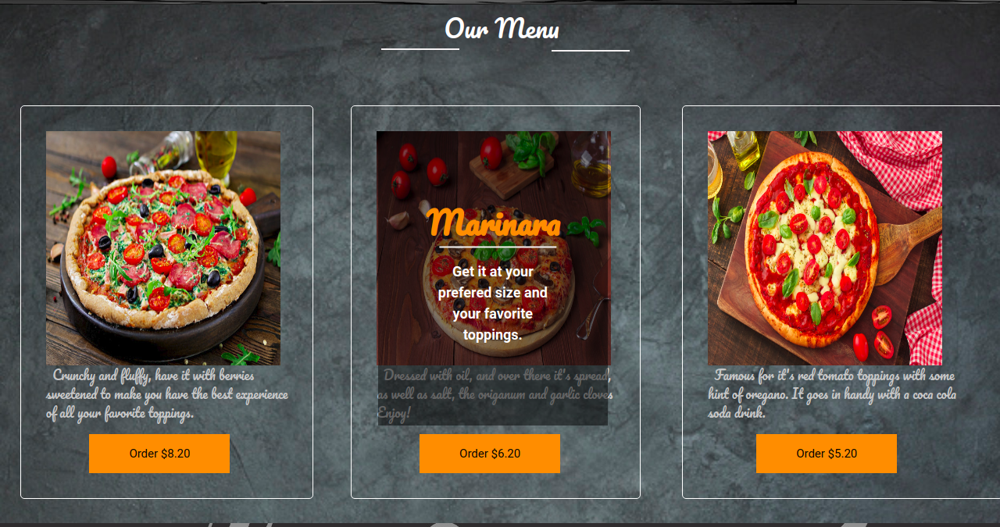
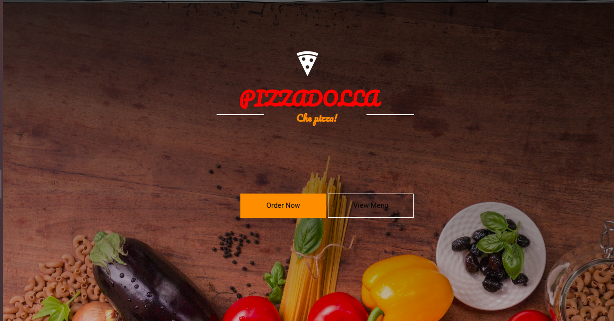
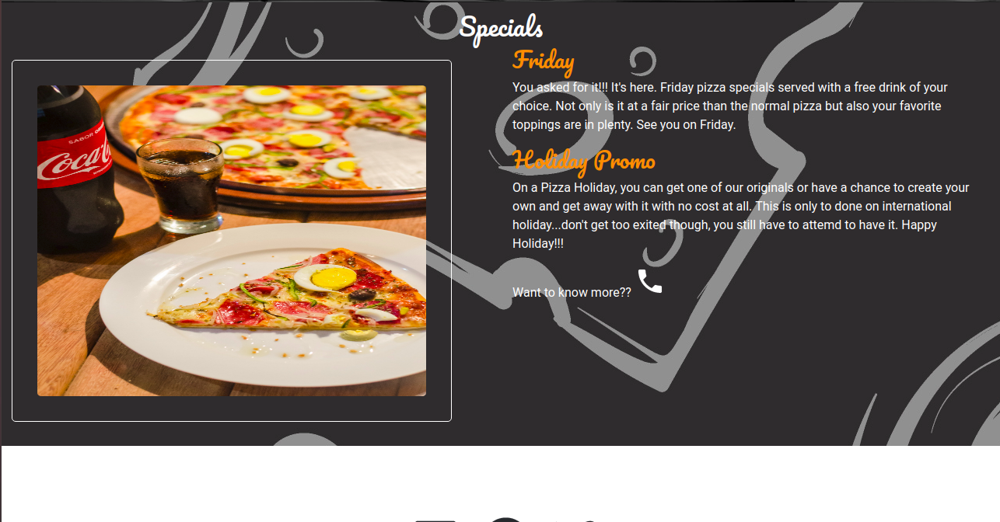
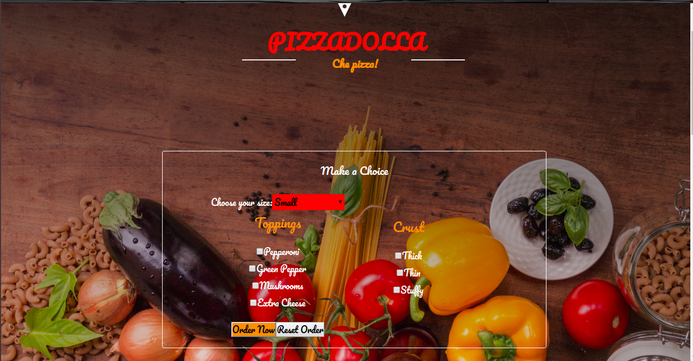

# Pizzadollar

#### Pizza Web AppWebsite, Monday June.

### By Davis

### Behaviour Driven Development (BDD)

| Behaviour expected to be handled | Order Pizza           | Output Example            |
| -------------------------------- | -----------------------|---------------------------|           
|Choose a pizza                  |  Choose the toppings,crust and size  |  Price determined|
|Order without choosing the type    | Determine the price    |    Order on the way         |
### Description

This website is an application of a pizza fictional resturant. It show the type of pizza a castomer can choose and order.
The app is still under construction.
As for now some of the parts can not function as required

### Desktop View

## Setup/Installation Requirements

To set up, click the link and redirected to a working github page website.
  *Chrome/safari/IE

## Known Bugs

The web functionality is best in an internet connected. 

## Technologies Used

  #### HTML

    This was the solid foundation language used to create the skeleton of the web.

 ##### Css
    Styled the sizings, postionings and altered some default bootstrap

#### Bootstrap

    This framework was strategically used to style the button.rows and columns.

  #### Javascript

    The objects, constructors and prototypes in this app are done through this language.

  #### Jquery

    This library  handled the hover and toggle events.
    
 ### Contact and Support

  Want to get in touch?

  * Email me davisdavy96@gmail.com
  * slack @moringaschool (Davis W)
  * Github Davisdavy

### License

MIT License

Copyright (c) [2019] [Davis wafula]

Permission is hereby granted, free of charge, to any person obtaining a copy
of this software and associated documentation files (the "Software"), to deal
in the Software without restriction, including without limitation the rights
to use, copy, modify, merge, publish, distribute, sublicense, and/or sell
copies of the Software, and to permit persons to whom the Software is
furnished to do so, subject to the following conditions:

The above copyright notice and this permission notice shall be included in all
copies or substantial portions of the Software.

THE SOFTWARE IS PROVIDED "AS IS", WITHOUT WARRANTY OF ANY KIND, EXPRESS OR
IMPLIED, INCLUDING BUT NOT LIMITED TO THE WARRANTIES OF MERCHANTABILITY,
FITNESS FOR A PARTICULAR PURPOSE AND NONINFRINGEMENT. IN NO EVENT SHALL THE
AUTHORS OR COPYRIGHT HOLDERS BE LIABLE FOR ANY CLAIM, DAMAGES OR OTHER
LIABILITY, WHETHER IN AN ACTION OF CONTRACT, TORT OR OTHERWISE, ARISING FROM,
OUT OF OR IN CONNECTION WITH THE SOFTWARE OR THE USE OR OTHER DEALINGS IN THE
SOFTWARE
